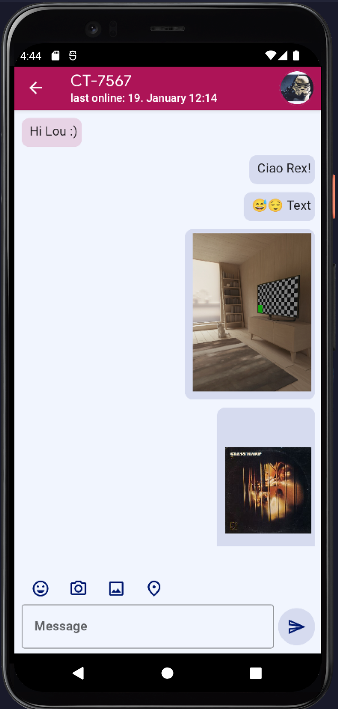

== ThatsApp

A student project as part of the module "Mobile application development" taught by Dr. Dieter Holz at the University of Applied Sciences Northwestern (FHNW)

=== Screenshot

Assignment description in German:

=== Die Aufgabe: Chat-Applikation

Entwerfen und implementieren Sie eine Chat-Applikation als native Android App mit Kotlin und Jetpack Compose.

Anforderungen:

* Legen Sie das wichtigste Herausstellungsmerkmal Ihrer App fest und beschreiben Sie es:
** Herausstellungsmerkmal meiner App: Die App ist besonders benutzerfreundlich. Die Profildaten werden persistiert und sind beim nächsten Start der App wieder verfügbar.

* Gewünschte Funktionalität
** Verschicken von Chat-Nachrichten an einzelne Personen einer Chat-Gruppe. ✔
** Verschicken eines, mit der Kamera des Android-Devices aktuell aufgenommenen, Bildes an den Chat-Teilnehmer. ✔
** Verschicken der aktuellen GPS-Position an den Chat-Teilnehmer. ✔
** Übersicht über alle Teilnehmer einer Chat-Gruppe. ✔
** Profile-Screen mit Name und Avatar-Bild. ✔

* Verwendung von MQTT zur Nachrichten-Verteilung ✔
* Versuchen Sie sich mit möglichst vielen anderen auf ein einheitliches JSON-Format zum Austausch von Nachrichten zu einigen. ✔
** Idealerweise können unterschiedliche Apps zum Chatten verwendet werden.
* Das UI ist komplett mit Jetpack Compose zu implementieren. ✔
** https://developer.android.com/jetpack/compose
* Implementierungssprache für die gesamte Applikation ist Kotlin. ✔
* Die im Unterricht erarbeitete Grundstruktur einer Android-App ist anzuwenden. ✔

=== Bewertung

Es können in diesem Assignment maximal 4 Punkte erreicht werden. Der Fokus liegt dabei, neben Umsetzung der gewünschten Funktionalität, auf der Code-Qualität. Der Coolness-Faktor des UI wird über den Coolest App Award berücksichtigt.

* 4 Punkte
** Umsetzung der gesamten gewünschten Funktionalität und der oben genannten Grundanforderungen
** App stimmt mit dem genannten Herausstellungsmerkmal überein
** Strukturierung der App in 3 Layer
** UI Code ist klar strukturiert in unabhängige Screens und via Composable Functions
** Chat mit mindestens einer weiteren App ist möglich
* 1 Punkt
** Text-Nachrichten zwischen zwei Teilnehmern können ausgetauscht werden. Die gesendeten/empfangenen Nachrichten der beiden Teilnehmer werden angezeigt. Der Avatar und der Name des Chat-Teilnehmers wird angezeigt.
* 0 Punkte
** falls die Kriterien für einen Punkt nicht erfüllt sind ;-)
** falls MQTT nicht zum Nachrichtenaustausch verwendet wird
** falls das Projekt nicht kompilierfähig ist
** falls die App abstürzt bevor der erste Screen angezeigt wird
** falls ihr Name nicht unter 'bearbeitet von' eingetragen ist
** für Plagiate
